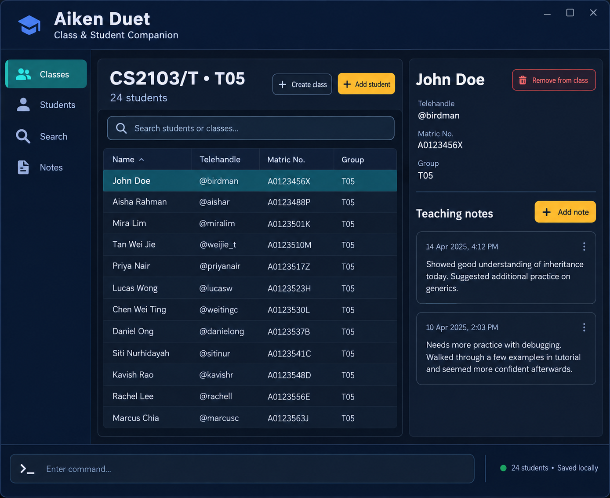

# Aiken Duet

Aiken Duet is a desktop application that helps teaching assistants manage classes, tutorial groups, students, and teaching-related observations. It is designed for fast keyboard-driven interaction through a command-line interface, with a graphical interface that makes class and student information easy to browse.

## Features

* Create and view classes with course codes and tags.
* Add students to specific tutorial, laboratory, or recitation groups.
* Search for students and classes using names, telehandles, matriculation numbers, or class groups.
* Record timestamped teaching notes for a student in a particular class group.
* Remove a student from one class group without deleting their other class enrolments.
* Store data locally so class information remains available between sessions.

## Getting started

1. Download the latest release from the [releases page](https://github.com/AY2627S1-CS2103T-F10-2/tp/releases).
2. Run the downloaded JAR file with `java -jar aiken-duet.jar`.
3. Type `help` in the command box to see the available commands.

## Documentation

* [User Guide](https://AY2627S1-CS2103T-F10-2.github.io/tp/UserGuide.html)
* [Developer Guide](https://AY2627S1-CS2103T-F10-2.github.io/tp/DeveloperGuide.html)
* [About Us](https://AY2627S1-CS2103T-F10-2.github.io/tp/AboutUs.html)

This project is based on the AddressBook-Level3 project created by the [SE-EDU initiative](https://se-education.org).
