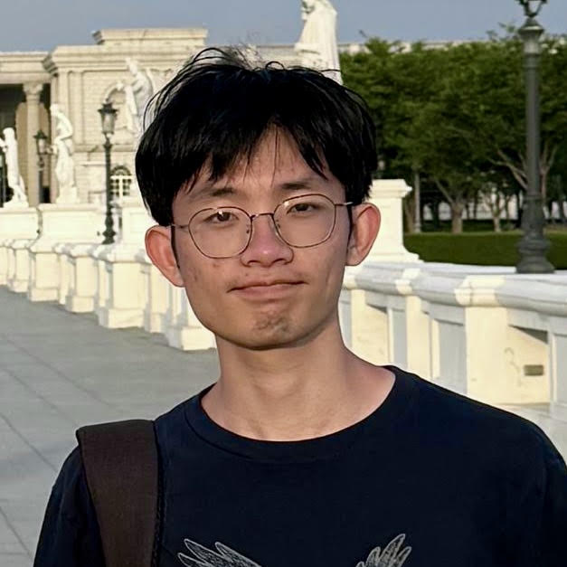
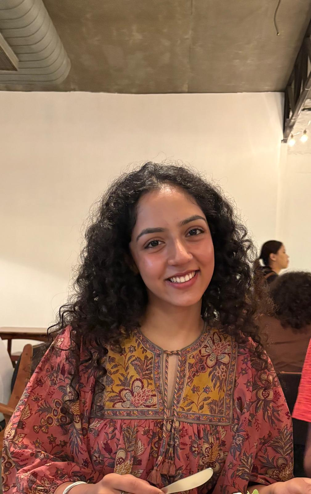
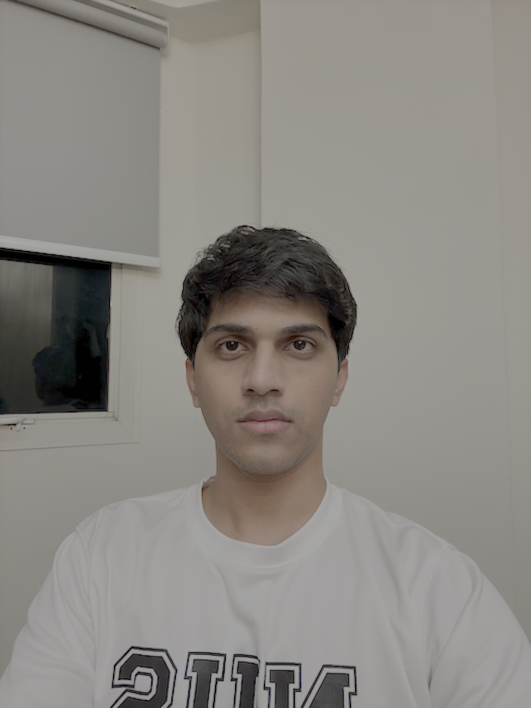
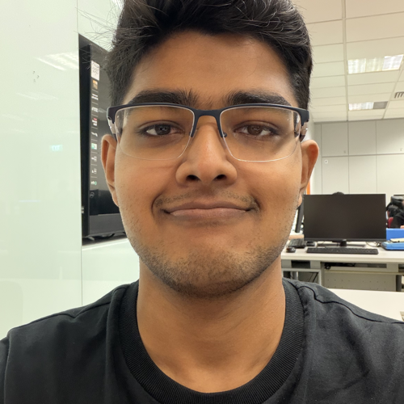

We are a team based in the [School of Computing, National University of Singapore](https://www.comp.nus.edu.sg).

You can reach us at the email `seer[at]comp.nus.edu.sg`

## Project team

### Jeng Han

[[github](https://github.com/Mimbao)]

* Role: Team Member
* Responsibilities: add features, manage team repo, keep everyone on schedule

### Aanya Yaduvanshi

[[github](https://github.com/aanya007)]

* Role: Developer
* Responsibilities: UI

### Advait Phadnis

[[github](https://github.com/advaitio)]

* Role: Developer
* Responsibilities: Adding features

### Jean Doe

[[github](http://github.com/johndoe)]
[[portfolio](team/johndoe.md)]

* Role: Developer
* Responsibilities: Dev Ops + Threading

### Krtin Goel

[[github](https://github.com/Krtin888)]

* Role: Developer
* Responsibilities: Documentation, testing, and code quality
